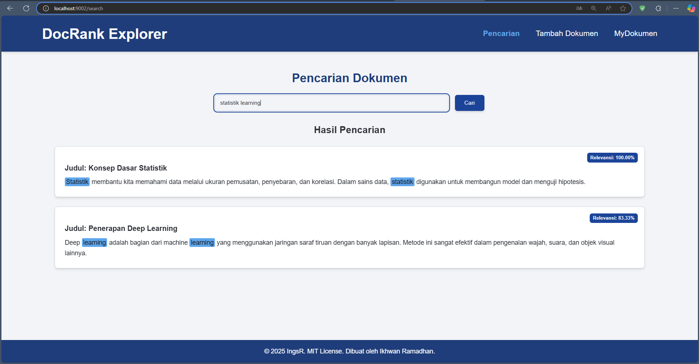
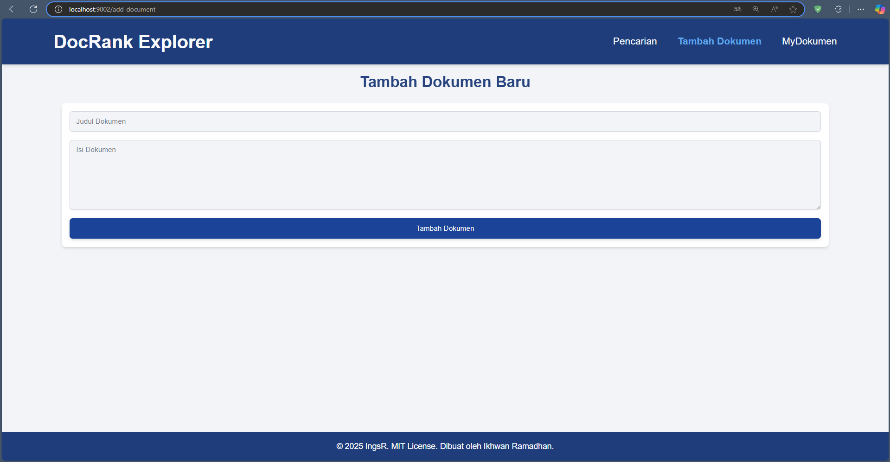
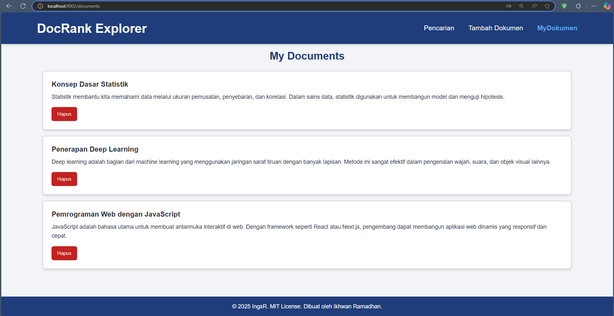

# 📄 Project TF-IDF Pencarian Dokumen

**Website:** [https://tfidf.vercel.app](https://tfidf.vercel.app)

Aplikasi web sederhana berbasis **Next.js** dan **TypeScript** untuk melakukan pencarian dokumen menggunakan algoritma **TF-IDF (Term Frequency - Inverse Document Frequency)**.

---

## 🚀 Fitur Utama 

- 📤 Upload dokumen lengkap dengan **judul dan isi**
- 🔍 Pencarian dokumen menggunakan algoritma **TF-IDF**
- 🧠 Peringkat hasil pencarian berdasarkan **skor relevansi**
- 🎨 Antarmuka bersih dan responsif dengan **Tailwind CSS**
- ⚙️ Dikembangkan menggunakan **React (Next.js)** dan **TypeScript**

---

## 🌐 Live Demo

Silakan kunjungi aplikasi di:  
👉 **[https://tfidf.vercel.app](https://tfidf.vercel.app)**

---


## 🛠️ Teknologi yang Digunakan

- [Next.js](https://nextjs.org/)
- [TypeScript](https://www.typescriptlang.org/)
- [Tailwind CSS](https://tailwindcss.com/)
- [React](https://reactjs.org/)
- [Node.js](https://nodejs.org/)
  

# User Interface

<h2 align="center"><strong>Fitur Pencarian Dokumen</strong></h2>




<h2 align="center"><strong>Formulir Penambahan Dokumen Baru</strong></h2




<h2 align="center"><strong>Tampilan Daftar Dokumen</strong></h2>




---
## 📁 Struktur Direktori
```bash
src/
├── app/
│   ├── add-document/      
│   ├── documents/      
│   └── search/       
├── components/           
├── hooks/                
├── lib/           
├── styles/        
└── types/         
```

**Instalasi Node Module**
```bash
npm install
```

**Instalasi depensi next.js**
```bash
npm run build
```

**Running localhost**
```bash
npm run dev
```

Proyek ini dilisensikan berdasarkan Lisensi MIT.
Lihat LICENSE untuk informasi lebih lanjut.
<div align="center">

---

## 👨‍💻 Author Ikhwan Ramadhan, 2025

</div>


